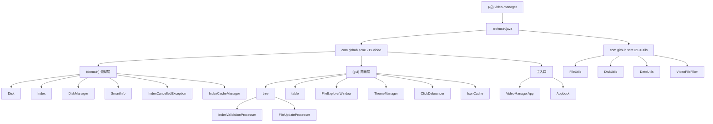

# Video Manager - AI 上下文文档

> 本文档由 AI 架构师自动生成，用于项目理解和协作开发
> 生成时间：2026-01-29 18:35:16
> 最后更新：2026-06-10

---

## 变更记录 (Changelog)

### 2026-06-10
- **新增本地统一索引缓存功能**
  - 每个磁盘 `.disk.sqlite` 新增 `disk_meta` 表存储 UUID 和磁盘名
  - 新增 `IndexCacheManager` 管理本地缓存目录（`~/.video-manager/indexes/{uuid}.sqlite`）
  - 磁盘挂载时自动同步索引副本到本地，支持离线搜索
  - 搜索结果标注磁盘名称和在线/离线状态
  - 状态栏显示 "N 个在线, M 个离线"
  - 离线文件灰色斜体渲染，文件名标注 `[磁盘名] (离线)`
  - 新增 `DiskManager.SearchResultItem` 封装搜索结果元数据
  - `DiskManager.loadDisks()` 自动调用 `syncToCache()` 同步缓存
  - 使用 `ConcurrentHashMap.newKeySet()` 替代 `HashSet` 保证线程安全
  - 注册表使用 Properties 格式存储（`~/.video-manager/registry.properties`）

### 2026-04-27
- **Bug 修复**
  - 修复 `Index.isIndexing` 字段缺少 `volatile`，跨线程可见性问题（#3）
  - 修复 `Index.create(Disk)` 异常时 `isIndexing` 永久为 true 的死锁问题，改为 finally 释放（#4）
  - 修复 `IconCache` 使用非线程安全的 `HashMap`，改为 `ConcurrentHashMap`（#5）
  - 修复 `TreeContextMenu` 中 SMART 检测在非 EDT 线程弹 `JOptionPane`，改为 `SwingUtilities.invokeLater`（#6）
- **性能优化**
  - `DiskManager.findDisk` 从 O(n) 线性搜索改为 O(1) HashMap 查找（#9）
  - `FileUtils.isVideoFile` 从遍历数组改为 `Set.contains` O(1) 查找（#11）
  - `Disk.findVideoDir` 合并 `hasVideoFiles` 避免重复 `listFiles` 调用（#12）
  - `FileTableModel` 改为直接持有 `List<File>`，消除 5 倍内存冗余的 `Object[][]`（#8）
  - `FileUtils.executeCommand` 添加 daemon 线程等待进程结束，防止僵尸进程（#21）
- **代码质量**
  - `DiskManager.getInstance()` 预热线程移至 static 块，避免每次调用创建新线程（#1）
  - `Index` 构造函数中预热线程设为 daemon，避免阻止 JVM 退出（#2）
  - `FileTableModel.tableHeader` 改为 `private static final`（#7）
  - `IndexStatistics` 使用 Lombok `@Getter @Setter` 替代手写 getter/setter（#16）
  - `ThemeManager` 添加 `@Slf4j`，替换 `System.err.println` 为 `log.error`（#17）
  - `FILE_SIZE_COMPARATOR` 简化为 `Long::compare`（#18）
  - `IndexRepository.createSchema` 复用 `ensureSchema`，消除 DDL 重复（#19）
  - `TreeContextMenu`、`ContextMenuBuilder` 的匿名内部类转为 lambda（#20）
  - `DiskManager.loadDisks` 的 `Comparator` 匿名类转为 lambda

### 2026-02-01 11:05:55
- **新增索引验证和清理功能**（validateAndCleanup）
  - 右键菜单新增"验证并清理索引"选项
  - 新增 `IndexValidationProcesser` 索引验证进度窗口
  - 新增 `IndexCancelledException` 索引取消异常类
  - 支持检查文件是否存在并删除无效记录
  - 支持取消操作（每100条记录检查一次）
- **新增单实例锁机制**（AppLock）
  - 使用 Java NIO FileLock 实现 OS 级别锁
  - 锁文件位置：`~/.video-manager/.lock`
  - 注册 JVM 关闭钩子自动释放锁
- **完善索引取消功能**
  - `Index.cancel()` 方法已实现
  - 支持索引进度窗口的取消操作
- **更新模块结构**
  - 识别 26 个 Java 源文件（100% 覆盖）
  - 新增 4 个核心组件：AppLock、IndexCancelledException、IndexValidationProcesser
  - Domain 模块新增验证和清理接口

### 2026-01-30 11:23:10
- 更新项目架构分析，补充最新功能模块
- 新增 `ClickDebouncer` 点击防抖组件
- 新增 `IconCache` 图标缓存组件
- 完善索引创建功能（目录级扫描 + 统计信息）
- 新增实时搜索功能（防抖延迟 700ms）
- 新增快捷键支持（Ctrl+F、Alt+W）
- 新增状态栏显示（文件数量、删除统计）
- 新增虚拟返回上级行（表格顶部）

### 2026-01-29 18:35:16
- 初始化 AI 上下文文档
- 生成根级架构总览和模块结构图
- 识别核心模块：domain、gui、utils
- 创建模块级文档，包含导航面包屑

---

## 项目愿景

**Video Manager** 是一个专为移动硬盘视频文件管理设计的桌面应用程序。它通过 SQLite 索引和多磁盘搜索功能，解决了移动硬盘上视频文件分散、难以快速定位的问题。

### 核心价值
- **快速检索**：跨多个移动硬盘统一搜索视频文件
- **便携索引**：基于相对路径的索引，支持盘符变化
- **中文支持**：简繁体转换，支持中文文件名搜索
- **轻量设计**：无后台服务，无复杂依赖，单文件运行
- **实时搜索**：可选的实时搜索功能，输入即搜索（700ms 防抖）
- **主题切换**：支持浅色/深色/跟随系统三种主题
- **索引维护**：支持索引验证和清理，删除无效记录
- **单实例控制**：防止多实例运行，确保数据一致性

---

## 架构总览

### 技术栈
- **语言**：Java 17
- **构建**：Maven
- **GUI**：Java Swing + FlatLaf（现代化主题）
- **数据库**：SQLite（每磁盘独立索引）
- **中文转换**：OpenCC4j
- **日志**：SLF4J + Logback
- **打包**：Maven Shade + Launch4j（生成 .exe）

### 设计原则
- **SOLID**：领域模型（Disk、Index）与 GUI 分离
- **KISS**：直接使用 Swing 组件，避免过度抽象
- **DRY**：文件操作工具类复用（FileUtils）
- **YAGNI**：当前仅支持视频文件，未扩展其他媒体类型
- **单例模式**：AppLock、DiskManager、ThemeManager 使用单例

---

## 模块结构图



---

## 模块索引

| 模块路径 | 职责 | 语言 | 入口文件 | 测试覆盖 | 文档链接 |
|---------|------|------|---------|---------|---------|
| `video.domain` | 领域模型：磁盘、索引、SMART信息、验证清理、本地索引缓存 | Java | `DiskManager.java` | 无 | [查看](./src/main/java/com/github/scm1219/video/domain/CLAUDE.md) |
| `video.gui` | Swing GUI：树、表、窗口、主题、点击防抖 | Java | `FileExplorerWindow.java` | 无 | [查看](./src/main/java/com/github/scm1219/video/gui/CLAUDE.md) |
| `utils` | 工具类：文件、磁盘、日期 | Java | `FileUtils.java` | 无 | [查看](./src/main/java/com/github/scm1219/utils/CLAUDE.md) |
| `video.gui.tree` | 文件树组件、右键菜单、索引进度窗口 | Java | `FileTree.java` | 无 | [查看](./src/main/java/com/github/scm1219/video/gui/tree/CLAUDE.md) |
| `video.gui.table` | 文件表格组件及渲染器 | Java | `FileTable.java` | 无 | [查看](./src/main/java/com/github/scm1219/video/gui/table/CLAUDE.md) |

---

## 运行与开发

### 环境要求
- **JDK**：17 或更高版本
- **OS**：Windows 64位
- **构建**：Maven 3.6+

### 本地运行
```bash
# 编译
mvn clean compile

# 运行
mvn exec:java -Dexec.mainClass="com.github.scm1219.video.VideoManagerApp"

# 打包（生成 .exe）
mvn clean package
```

### 输出文件
- `target/video-manager.jar` - 可执行 JAR
- `target/video-manager.exe` - Windows 可执行文件

### 关键配置
- **主题配置**：`~/.video-manager/theme.properties`
- **锁文件**：`~/.video-manager/.lock`
- **索引标记**：`<磁盘根目录>/.disk.needindex`
- **索引文件**：`<磁盘根目录>/.disk.sqlite`
- **索引缓存目录**：`~/.video-manager/indexes/{uuid}.sqlite`
- **缓存注册表**：`~/.video-manager/registry.properties`

---

## 最新功能特性

### 1. 本地统一索引缓存（2026-06-10）✨
- **功能描述**：将移动硬盘上的索引文件同步到本地，支持磁盘离线时搜索
- **实现原理**：
  - 每个磁盘首次索引时自动生成 UUID，存入 `.disk.sqlite` 的 `disk_meta` 表
  - 磁盘挂载时自动将 `.disk.sqlite` 复制到 `~/.video-manager/indexes/{uuid}.sqlite`
  - 搜索时：已挂载磁盘查实时数据，未挂载磁盘查本地缓存副本
  - 结果标注磁盘名称和在线/离线状态
- **触发方式**：自动同步（磁盘挂载时），无需手动操作
- **代码位置**：
  - `IndexCacheManager` - 缓存管理器（新建）
  - `DiskManager.searchAllFilesWithDiskInfo()` - 在线+离线统一搜索
  - `Disk.ensureUuid()/syncToCache()` - UUID 管理和缓存同步
  - `IndexRepository` - 新增 `disk_meta` 表和 CRUD 方法
- **UI 变化**：
  - 离线文件灰色斜体渲染，文件名标注 `[磁盘名] (离线)`
  - 路径列显示 `[磁盘名] /path/to/file`
  - 状态栏显示 "搜索结果: N 个项目 (M 个在线, K 个离线)"

### 2. 索引验证和清理（2026-02-01）✨
- **功能描述**：验证索引记录有效性，删除文件已不存在的无效记录
- **触发方式**：右键菜单 → 索引菜单 → 验证并清理索引
- **实现原理**：
  - 遍历所有索引记录，检查文件是否存在
  - 使用事务批量删除无效记录
  - 支持取消操作（每100条记录检查一次）
- **代码位置**：
  - `Index.validateAndCleanup()` - 核心逻辑（行 779-900+）
  - `IndexValidationProcesser` - 进度窗口（183行）
  - `Disk.performValidateAndCleanup()` - 入口方法
- **统计信息**：总记录数、删除无效记录数、耗时

### 3. 单实例锁机制（2026-02-01）✨
- **功能描述**：防止应用多实例启动，确保数据一致性
- **实现方式**：Java NIO FileLock（OS 级别文件锁）
- **锁文件位置**：`~/.video-manager/.lock`
- **关键特性**：
  - 非阻塞独占锁（`tryLock()`）
  - JVM 关闭钩子自动释放锁
  - 友好的错误提示
- **代码位置**：`AppLock.java`（197行）
- **入口调用**：`VideoManagerApp.main()`（行 21-25）

### 4. 索引取消功能完善（2026-02-01）✨
- **功能描述**：支持索引进度窗口的取消操作
- **实现方式**：
  - `Index` 类新增 `volatile boolean isCancelled` 标志位
  - `Index.cancel()` 方法设置取消标志
  - 索引循环中定期检查 `checkCancelled()`
  - 抛出 `IndexCancelledException` 终止操作
- **代码位置**：
  - `Index.cancel()` - 取消方法（已实现）
  - `IndexCancelledException` - 取消异常类
  - `Disk.findVideoDir()` - 检查点（行 74-78）

### 5. 实时搜索（2026-01-29）
- **功能描述**：勾选"实时搜索"复选框后，输入时自动触发搜索（700ms 延迟）
- **实现原理**：使用 `javax.swing.Timer` 实现防抖机制
- **代码位置**：`FileExplorerWindow.java` (行 157-166, 815-842)
- **优势**：避免频繁查询数据库，提升性能

### 6. 快捷键支持（2026-01-29）
- **Ctrl + F**：定位搜索框并选中全部文本
- **Alt + W**：清空搜索内容并刷新表格
- **实现方式**：使用 `InputMap` 和 `ActionMap` 注册全局快捷键
- **代码位置**：`FileExplorerWindow.java` (行 989-1025)

### 7. 目录级扫描（2026-01-27）
- **功能描述**：右键菜单支持扫描指定目录，显示详细统计信息
- **统计信息**：扫描文件总数、新增文件数、删除旧记录数、扫描耗时
- **实现原理**：先删除目录旧索引记录，再递归扫描并插入新记录
- **代码位置**：
  - `Index.createForDirectory()` - 核心索引逻辑（行 324-454）
  - `FileUpdateProcesser` - 进度窗口（GUI）
  - `FileExplorerWindow` 右键菜单（行 189-236）

### 8. 主题切换（2026-01-28）
- **支持主题**：浅色、深色、跟随系统
- **配置持久化**：保存到 `~/.video-manager/theme.properties`
- **实现方式**：使用 FlatLaf 库，运行时切换主题
- **代码位置**：`ThemeManager.java` (单例模式)

### 9. 状态栏显示（2026-01-29）
- **浏览模式**：显示文件总数（"共 100 个项目"）
- **搜索模式**：显示搜索结果数量和已删除文件数（"搜索结果: 50 个项目，已删除: 5 个"）
- **代码位置**：`FileExplorerWindow.updateStatusBar()` (行 449-464)

### 10. 虚拟返回上级行（2026-01-27）
- **功能描述**：在非根目录时，表格顶部插入"返回上一级"虚拟行
- **实现方式**：`FileTableModel` 增加 `showParentRow` 标志，渲染器特殊处理第 0 行
- **代码位置**：
  - `FileTableModel.isParentRow()` - 判断虚拟行
  - `FileTableCellRenderer` - 虚拟行样式渲染
  - `FileExplorerWindow` - 双击虚拟行事件处理（行 738-746）

### 11. 点击防抖（2026-01-27）
- **功能描述**：防止用户快速双击导致重复打开文件
- **实现方式**：`ClickDebouncer` 记录最近打开的文件路径和时间戳
- **代码位置**：`ClickDebouncer.java`

---

## 测试策略

### 当前状态
- 无单元测试框架（JUnit/TestNG 未配置）
- 仅有 `src/test/java` 下的临时测试类（`DiskTest.java`、`RenameFiles.java`、`DiskSmartInfo.java`）

### 建议改进
- 为核心领域模型添加单元测试（Disk、Index、DiskManager）
- 使用 JUnit 5 + Mockito
- 测试文件操作的工具类需要使用临时目录

---

## 编码规范

### 命名约定
- **包名**：全小写，`com.github.scm1219.video.*`
- **类名**：大驼峰，`FileExplorerWindow`、`DiskManager`
- **方法名**：小驼峰，`searchAllFiles()`、`createIndex()`
- **常量**：全大写下划线，`FLAG_FILE`、`THEME_LIGHT`

### 代码风格
- 使用 Lombok 减少样板代码（`@Data`、`@Slf4j`）
- GUI 组件使用匿名内部类注册事件监听器
- 异常处理：打印堆栈并显示用户友好的 JOptionPane
- 单例模式使用双重检查锁定（AppLock）

### 注释规范
- 公共 API 必须添加 Javadoc
- 复杂逻辑添加行内注释说明

---

## AI 使用指引

### 适用任务
- 阅读和理解现有代码结构
- 添加新功能（如新的文件类型支持、新的主题）
- 修复 Bug（GUI 事件处理、索引逻辑）
- 优化性能（索引速度、搜索响应时间）
- 完善索引取消和验证功能

### 不适用任务
- 重写整个 GUI 框架（如迁移到 JavaFX）
- 更改数据库 Schema（SQLite 表结构）
- 移除对 Windows 的依赖（当前深度耦合 rundll32、explorer）

### 关键上下文
- 索引文件使用相对路径（去除盘符），实现便携性
- 中文文件名使用 OpenCC4j 转换为简体后再搜索
- 线程安全：`isIndexing` 标志防止重复索引
- GUI 使用 SwingWorker 避免阻塞事件分发线程
- 实时搜索使用 Timer 防抖，延迟 700ms 触发查询
- 单实例锁使用 NIO FileLock，确保 OS 级别互斥
- 索引验证支持取消，每100条记录检查一次标志位
- 本地索引缓存使用 UUID 标识磁盘，缓存副本存储在 `~/.video-manager/indexes/`
- 搜索结果通过 `DiskManager.SearchResultItem` 携带磁盘名和在线/离线状态
- `parallelStream` 中使用 `ConcurrentHashMap.newKeySet()` 保证线程安全

---

## 相关资源

- **主入口**：`src/main/java/com/github/scm1219/video/VideoManagerApp.java`
- **构建配置**：`pom.xml`
- **用户文档**：`README.md`
- **Git 仓库**：`https://github.com/scm1219/video-manager`

---

## 覆盖率分析

### 已扫描文件
- **Java 源文件**：27 个（100% 覆盖）
  - 主程序：2 个（VideoManagerApp.java、AppLock.java）
  - 领域层：6 个（Disk.java、DiskManager.java、Index.java、SmartInfo.java、IndexCancelledException.java、IndexCacheManager.java）
  - GUI 层：12 个（FileExplorerWindow.java、ThemeManager.java、ClickDebouncer.java、IconCache.java、tree 包 5 个、table 包 3 个）
  - 工具类：4 个（FileUtils.java、DiskUtils.java、DateUtils.java、VideoFileFilter.java）
  - 辅助类：3 个（AppConfig.java、IndexScanner.java、ProgressCallback.java）
- **测试文件**：3 个（已识别但未深入分析）
- **资源文件**：2 个（图标文件）

### 文件分类统计
- **领域层**：6 个文件（Disk、DiskManager、Index、SmartInfo、IndexCancelledException、IndexCacheManager）
- **GUI 层**：12 个文件（FileExplorerWindow、ThemeManager、tree 包 5 个、table 包 3 个、ClickDebouncer、IconCache）
- **工具类**：4 个文件（FileUtils、DiskUtils、DateUtils、VideoFileFilter）
- **主入口**：2 个文件（VideoManagerApp、AppLock）
- **测试类**：3 个文件

### 缺口分析
- [x] 实现索引取消功能（已完成）
- [x] 实现索引验证和清理功能（已完成）
- [x] 实现单实例锁机制（已完成）
- [x] 实现本地统一索引缓存功能（已完成）
- [ ] 缺少领域模型的单元测试
- [ ] 缺少 GUI 组件的集成测试
- [ ] 缺少性能测试（大规模文件索引）
- [ ] 缺少国际化支持（当前硬编码中文）

### 下一步建议
1. 补充单元测试（使用 JUnit 5）
2. 添加 CI/CD 配置（GitHub Actions）
3. 性能优化：考虑多线程索引
4. 功能扩展：支持更多视频格式（如 .avi、.mov）
5. 完成 IconCache 实现（已完成 ConcurrentHashMap 线程安全改造）
